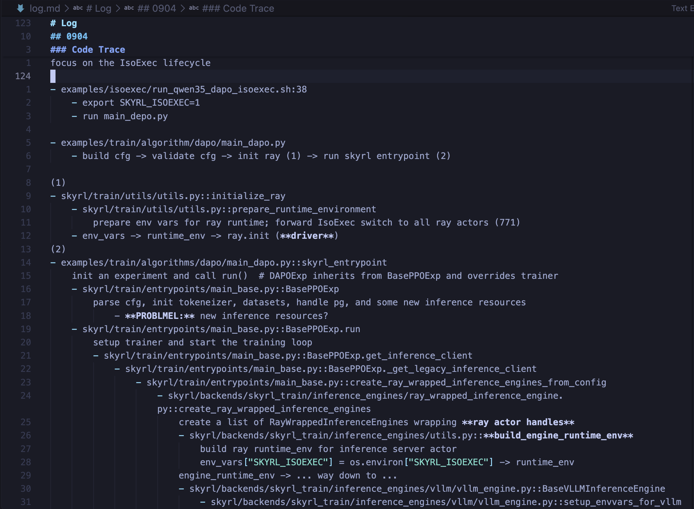

> What we do now echoes in eternity.
> ― Marcus Aurelius, Meditations

**TL;DR -** I traced the IsoExec lifecycle halfway without the coding agent's help. A little bit slower but peacefully. I'll finish tomorrow and start running experiments.

*I should express my genuine thoughts more faithfully.*